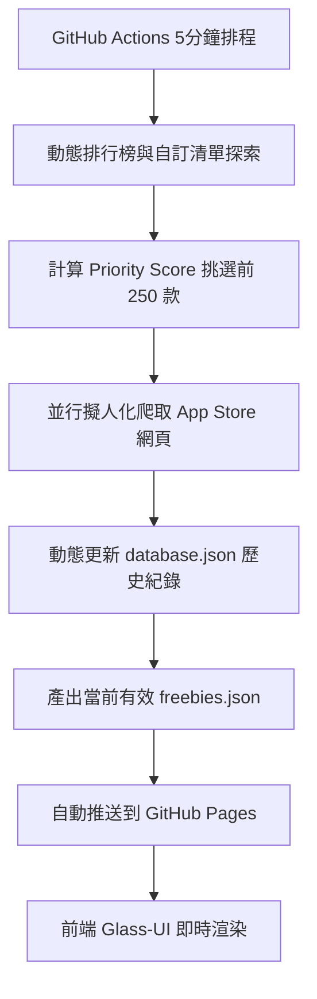

# 🎁 iOS IAP Freebie Tracker (iOS 內購限免追蹤器)

[](https://github.com/Dr-XYZ/ios-iap-freebie-tracker/actions/workflows/crawler.yml)
[](https://github.com/Dr-XYZ/ios-iap-freebie-tracker/actions/workflows/pages/pages-build-deployment)
[](https://opensource.org/licenses/MIT)

一個全自動運作的 **iOS App 內購限免（In-App Purchase Freebies）追蹤系統**。透過 GitHub Actions 每 5 分鐘自動排程運作，自動爬取台灣 App Store 排行榜與自訂追蹤清單，並透過精美的 Glassmorphic（毛玻璃風）網頁展示當前所有有效的內購限免項目！

👉 **[點此查看 Live 限免網頁](https://Dr-XYZ.github.io/ios-iap-freebie-tracker/)**

---

## ✨ 核心特色

### 1. 🧠 動態權重分數排程演算法 (Dynamic Priority Score)
為解決 Apple CDN 頻繁阻擋高頻爬蟲的限制，系統不採用盲目爬取，而是為每款 App 計算動態優先級：
- **自訂追蹤（Watchlist）**：最高優先級，每輪必爬。
- **排行榜熱門（Top 5 Charts）**：極高優先級，快速反應排行變動。
- **在線限免中（Active Freebies）**：每 10-15 分鐘覆檢一次，確保過期降價第一時間被下架。
- **無內購軟體（No IAP Placeholders）**：極低優先級，每 3 天僅複檢一次，節省 75% 的無效請求。
- **無效連結（Failed 404）**：降低至每月複檢一次，避免無效流量。

### 2. 🌏 五地區聯合探索擴展 (Multi-Region Discovery)
系統同時抓取 **台灣（tw）、香港（hk）、美國（us）、日本（jp）、韓國（kr）** 五個 App Store 地區的排行榜，每個分類以最大極限 `limit=200` 爬取：
- 相比原有單一台灣地區，**資料庫覆蓋規模提升至 8,000+ 款**，突破單一地區的排行榜瓶頸。
- 港日美韓的榜單包含大量台灣未進榜但仍然提供限免的優質 App，大幅提升限免偵測機率。

### 3. 🛡️ 擬人化反偵測爬取 (Stealth Scraper)
內建完善的伺服器防封鎖機制，保障高頻（每 5 分鐘一次）運作下的穩定度：
- **User-Agent 輪替**：隨機使用 Chrome、Safari (Mac/iOS)、Firefox 等多種標頭，偽裝成多元設備的正常瀏覽。
- **隨機抖動延遲（Jitter Delay）**：每次請求加入 1.0 ~ 2.5 秒的隨機延遲，打亂固定請求節奏。
- **動態 IP 輪轉**：充分利用 GitHub Actions 每次分配不同 Azure 虛擬機 IP 的特性，從物理層面免除 IP 封鎖。

### 4. 📱 軟體群組化精美介面 (Grouped UI)
- 將同一個 App 下的多個限免內購項目（如不同的高級訂閱、解鎖包）自動整合成單一卡片，拒絕版面凌亂。
- 全網頁採用現代 Glassmorphic 暗色系毛玻璃設計，具備流暢的微動畫與自適應手機排版。
- 具備即時搜尋過濾、分類切換（應用/遊戲），以及針對失效圖示的防破圖 Placeholder。

---

## 📊 監控進度狀態 (Monitoring Progress)

<!-- STATS_START -->
| 狀態類別 (Category) | 軟體數量 (Count) | 爬取頻率與策略 (Crawl Strategy) |
| :--- | :--- | :--- |
| 🟢 **追蹤中 (Active Tracking)** | **516** 款 | 證實有內購且 24 小時內偵測過，高頻輪替檢查 |
| ⏳ **待追蹤 (Pending Discovery)** | **5889** 款 | 剛進榜或超過 24 小時未偵測，等待爬取中 |
| 💤 **排除中 (No IAP Excluded)** | **1780** 款 | 證實無內購，每 3 天低頻冷卻複檢 |
| ❌ **已失效 (Persistent 404)** | **1290** 款 | 疑似被伺服器阻擋或地區限制，每 30 天極低頻重試 |
| 📦 **總收錄規模 (Total Database)** | **9475** 款 | 當前覆蓋的所有 App Store 行動目錄總量 |
<!-- STATS_END -->

---

## 🛠️ 如何運作



---

## ⚙️ 快速上手與部署

如果您想要部署一套屬於您自己的 iOS 限免追蹤系統，只需簡單幾步：

### 1. 複製儲存庫 (Fork)
點擊本專案右上角的 **Fork** 鍵，將專案複製到您自己的 GitHub 帳戶下。

### 2. 設定自訂追蹤清單 (Watchlist)
編輯儲存庫根目錄下的 `watchlist.json`，在陣列中加入您特別想即時盯梢的 App ID（例如：Canva 的 ID 為 `897446215`）：
```json
[
  "897446215",
  "1091189122"
]
```

### 3. 啟用 GitHub Actions 與 GitHub Pages
1. 前往您 Fork 的 Repository 的 **Settings > Actions > General**，確認 "Workflow permissions" 設為 **"Read and write permissions"**（爬蟲需要寫入更新回 JSON 檔案）。
2. 前往 **Settings > Pages**：
   - "Build and deployment" 的 Source 選擇 **"GitHub Actions"**。
3. 前往 **Actions** 頁面，手動啟用並觸發 **"iOS IAP Freebie Crawler"** 工作流。

部署完成後，您就可以在 `https://<您的 GitHub 帳號>.github.io/ios-iap-freebie-tracker/` 瀏覽您專屬的追蹤網頁！

---

## 📄 開源授權

本專案採用 **[MIT License](LICENSE)** 授權。

---

## 🤖 AI 協同開發聲明

本專案之**爬蟲核心邏輯、動態優先權最大化演算法、反封鎖機制、以及 Glassmorphism 前端網頁與介面安全性優化**，皆是由人類開發者與 **Google DeepMind 的 Antigravity 智慧寫程式助手** 協同 Pair Programming 完成。🤖✨
